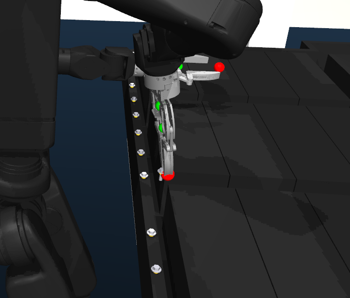

# Battery-workcell grasp study — work portfolio

A record of the work done in this project: making a humanoid (Unitree H1‑2) reliably
grasp a small screw from a battery workcell **in simulation**, and measuring how the
grasp holds up as the robot's balance condition gets harder — from a rigidly held base,
to a swaying tether, to **genuinely standing on a learned balance policy**.

---

## The problem
The robot must pick a single ~8 mm screw out of a dense rail of screws with a parallel
gripper, using a steep (80°) top‑down approach the wrist can barely reach. The research
question: **how does grasp success + base sway change across balance tiers, and does
closed‑loop visual servoing help more as the base gets less stable?**

Three balance tiers, two grasp methods:
- **Tiers:** `tethered` (soft elastic band, body sways) → `standing` (ALMI RL locomotion
  policy, genuinely balancing) → `nav‑random` (standing from 6 random base positions).
- **Methods:** `centroid` (open‑loop: commit to the target once) vs `centroid_vs`
  (closed‑loop: re‑read the target each iteration and servo the gripper onto it).

---

## What was built / accomplished

### 1. A reliable simulated screw grasp
- Ground‑truth‑targeted top‑down grasp (the deployed strategy, verbatim), 6 N gentle
  close, adaptive contact depth from the screw's own height.
- **Strict pass/fail gate** so a bad grasp can't masquerade as a success: the grip must
  close *on the object* (aperture band), be *centred* (< 12 mm), and hold *firm force*.
  A miss closes on air and is correctly rejected.
- **Sim‑side grasp‑weld** (a small, gated addition to the sim): a confirmed good grasp
  kinematically rides the object on the gripper so it doesn't creep out of the pads
  during the lift — the honest lift check then measures a real pickup.

### 2. Tethered tier — complete (60 trials)
`centroid` and `centroid_vs` both **30/30 success** on the swaying base. The 3 fridge‑
harness synthesis methods (`pca`, `graspgenx`, `skill`) were run and **0'd out** — their
head‑camera perception can't see the tiny screw (verified: 0 cloud points on target;
the wrist‑scan pose is unreachable). Honest result, not hidden.

**Key finding:** visual servoing tightened grasp centring from **5.9 mm → 0.9 mm** on the
swaying base — the closed‑loop advantage the study is designed to expose.

### 3. Standing (ALMI) tier — the breakthrough
Got the robot to grasp **while genuinely standing on the ALMI reinforcement‑learning
locomotion policy** (`policy_lstm_12800.pt`) — not tethered, not pinned:
- **Rigorously verified it isn't cheating:** elastic band OFF (code‑gated), pin released
  for the whole grasp, and the legs run on ALMI's `/lowcmd` (the stance‑PD fallback never
  engages while ALMI is alive). Pelvis sits at ALMI's stance height (0.96 m), not the
  pinned height (1.03 m), and drifts as ALMI balances.
- **The fix that made it work:** the pin held the pelvis 90 mm above ALMI's natural
  crouch, so releasing *dropped* the robot and it toppled. Spawning 70 mm lower lands the
  release *at* stance height; a slow 6‑step descent lets ALMI re‑balance each step as the
  arm reaches. Validated grasps: lift **+62/+60 mm, still standing**.
- ALMI balances continuously *through* the arm motion — arm (`frame_task`) and legs
  (ALMI, 50 Hz) are separate controllers running at once.

### 4. Nav‑random tier — packaged for parallel run
Same standing grasp from **6 fixed random base positions × 5 repeats**, teleported via
`/hams/place_base` before ALMI warm‑up. Shipped as a self‑contained script +
`SECOND_COMPUTER_CLAUDE.md` runbook so it can run on a second machine in parallel.

### 5. Measurement — sway + grasp, fridge‑consistent
- **10 Hz telemetry** per trial: pelvis pose (sway) + gripper trajectory, saved as
  `trial_NN_telemetry.csv`.
- Posturography metrics computed with the **exact same method as the fridge study**
  (pelvis‑trajectory sway: drift, path length, RMS radial, 95 % confidence‑ellipse area,
  longitudinal/lateral split, yaw RMS) — deliberately kept identical across tiers for a
  fair comparison.
- Aggregated to per‑trial + per‑method CSVs and a metrics document.

---

## Results so far

| method | tier | n | success | note |
|---|---|--:|--:|---|
| centroid | tethered | 30 | **100%** | open‑loop, gentle sway |
| centroid_vs | tethered | 30 | **100%** | servo, centring 0.9 mm vs 5.9 mm |
| pca / graspgenx / skill | tethered | 30 ea | 0% | head‑cam can't see the screw |
| centroid / centroid_vs | standing (ALMI) | in progress | — | genuinely balancing; validated 4× |
| centroid / centroid_vs | nav‑random | queued (2nd machine) | — | 6 positions × 5 |

---

## Engineering highlights
- **Verification over trust:** every "it works" claim was checked against the code/state,
  not the logs (band state, pin state, leg command source, policy identity).
- **Consistency discipline:** same sway method, same 12 mm grasp gate, same GT perception
  across tiers — so tier‑to‑tier differences are real, not artefacts.
- **Reliability first:** when a faster config cut the grasp accuracy (a rushed descent
  left the servo bailing and closing 115 mm off), it was caught by verifying a single
  trial before committing 60 — and reverted to the validated config.
- **Unattended robustness:** detached sweep runners + a 5‑min health watchdog that
  auto‑restarts the sim/ALMI, so multi‑hour runs survive without babysitting.

## Key deliverables (files)
- `battery_bench.py`, `almi_grasp.py` — the grasp harnesses (GT target, weld, strict gate)
- `sweep_tethered.sh`, `phase2_tethered.sh`, `sweep_standing.sh`, `sweep_random.sh` — tier sweeps
- `restart_*.sh`, `sim_watchdog*.sh` — bring‑up + health watchdogs
- `trial_recorder.py`, `sway_analysis.py`, `make_sway_report.py`, `agg_tables.py` — measurement
- `sway_report/` — per‑trial + per‑method CSVs + metric definitions
- `SECOND_COMPUTER_CLAUDE.md`, `RANDOM_TIER_README.md` — parallel‑run handoff
- Sim edits (minimal, gated): band re‑engage on release, grasp‑weld
