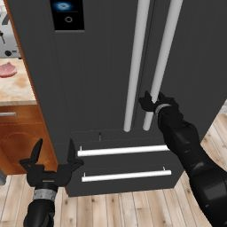
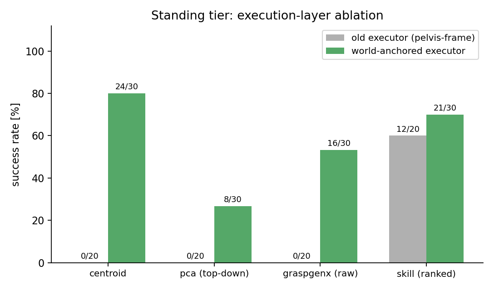
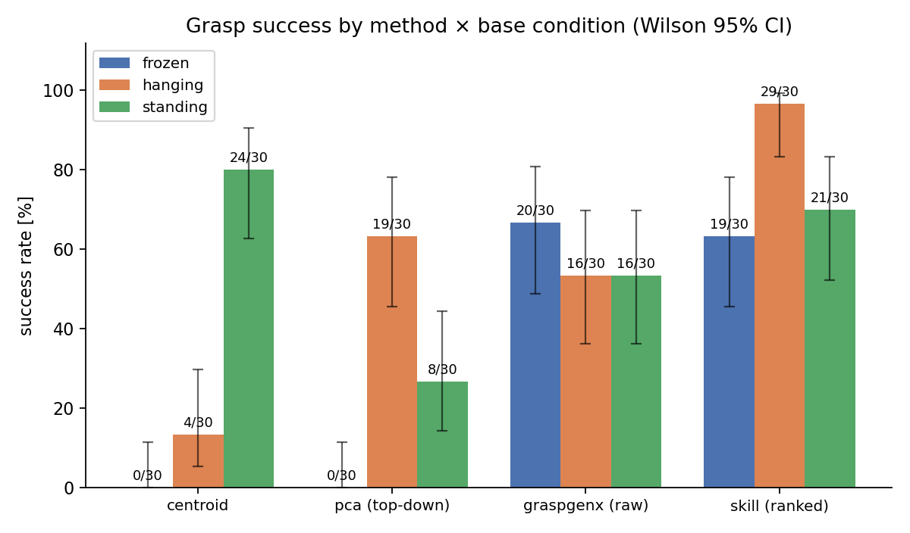
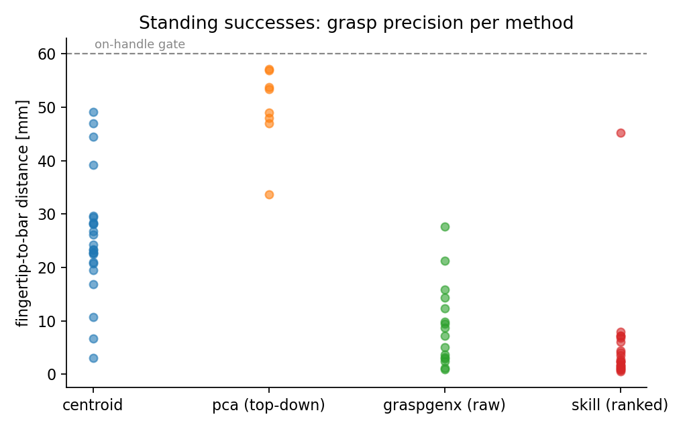
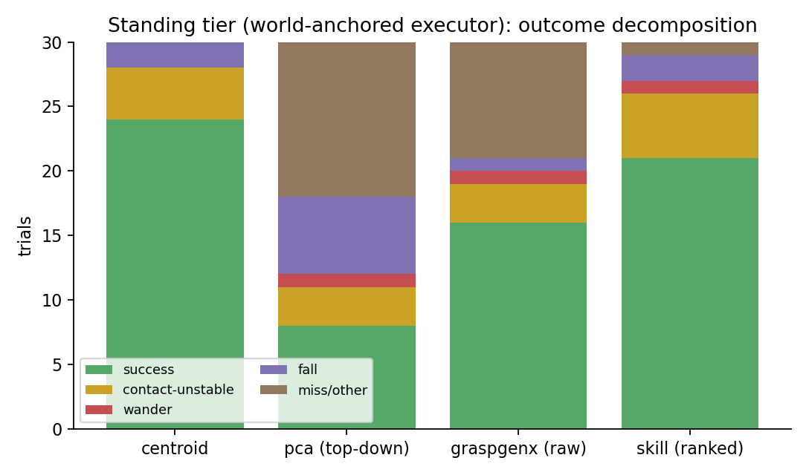
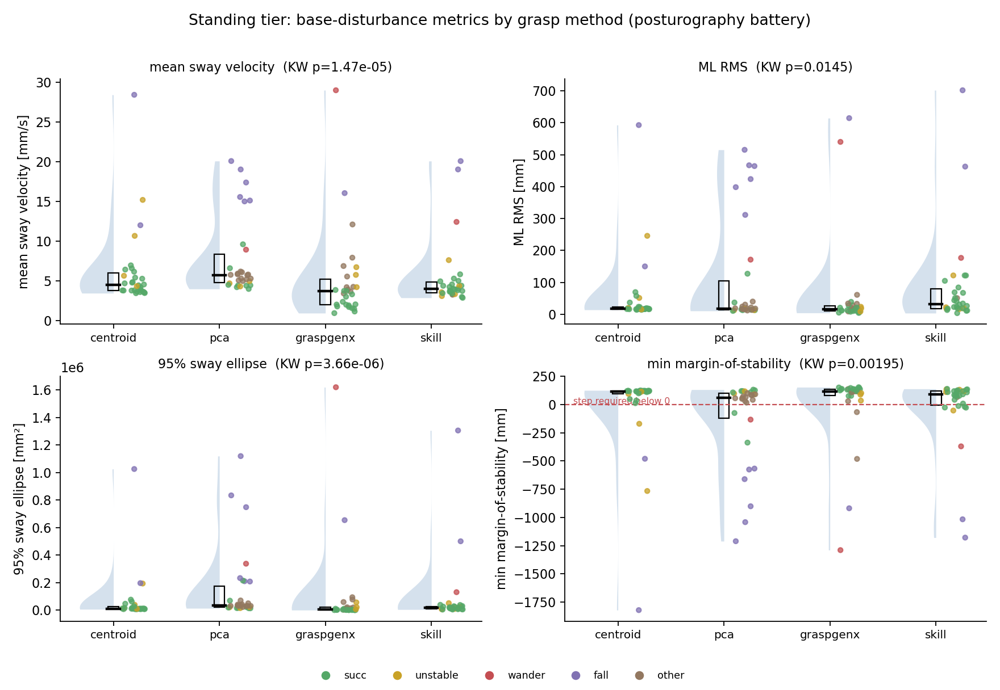
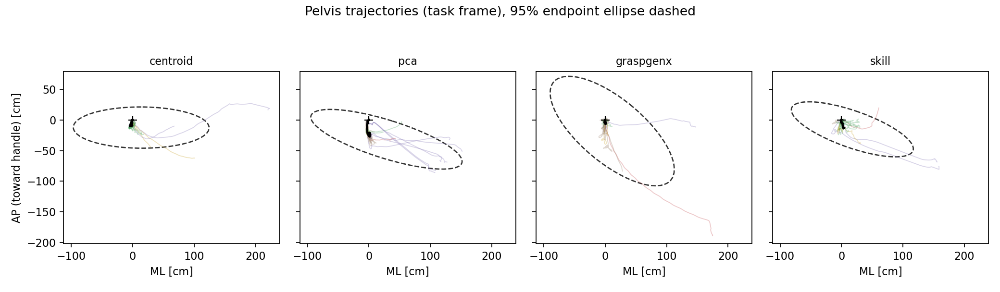
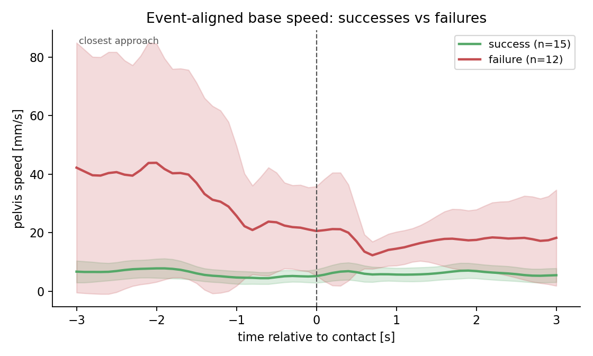

# Grasping while balancing — extending a humanoid grasp benchmark to an actively-balancing base

**My contribution to the HAMS grasp study · humanoid robotics · RL locomotion under manipulation load · execution-layer control · sway analysis**

> The lab had a grasp benchmark that compared four grasp strategies on a
> **fixed** and a **passively-tethered** humanoid base. My contribution was to
> add the hard third condition — the robot **free-standing on an RL balance
> policy, actively balancing while it grasps** — and to figure out why grasping
> from a moving base is a fundamentally different problem. The answer turned out
> to change how the whole benchmark is interpreted.

---

## At a glance

| | |
|---|---|
| **Scope of my contribution** | The **standing (actively-balancing) tier** + the execution-layer finding + the sway/stability analysis pipeline |
| **Built on** | An existing 2-condition (frozen / hanging) grasp benchmark on the Unitree H1-2 |
| **Platform** | MuJoCo / RoboCasa, ROS 2 Humble, Unitree DDS, ALMI LSTM balance policy (50 Hz) |
| **What I ran** | 120-trial standing sweep + executor ablation + ground-truth perception control + n=30 top-ups (200+ trials) |
| **Headline finding** | The reported baseline failures were an **execution-layer artifact, not a grasp or balance limit** — a world-anchored executor took three methods from **0/20 to viable (up to 80%)** |

---

## The problem I took on

The existing benchmark grasped a fridge handle with the robot's body either
**rigidly pinned** or held by a **passive elastic tether**. Both avoid the real
humanoid challenge: a robot that must **keep itself upright while it reaches**.
When the arm moves, the body sways, and the balance policy takes small recovery
steps — so the ground under the arm is literally moving mid-grasp.

My job: integrate an actively-balancing base into the study without changing the
task or the grading, and find out whether grasp strategy still matters when the
base won't hold still.

---

## What I built

- **Standing-tier integration.** Drove the **ALMI LSTM whole-body balance
  policy** live during manipulation (not replayed), with a *freeze-hold engage
  protocol*: pin the body during setup so the recurrent policy can converge,
  engage it, then release — so every trial starts from a verified upright state.
- **A world-anchored, drift-compensated grasp executor** (the core technical
  contribution — see below).
- **An autonomous, resumable experiment harness**: fresh/warm-reset environment
  per trial, full per-trial instrumentation (result JSON, 10 Hz telemetry,
  rosbag, servo logs, head snapshots), self-healing recovery, and skip-based
  resume so a 100+ trial campaign runs unattended overnight.
- **A self-refreshing analysis pipeline** ("paper bank") that regenerates every
  figure and table as new trials land, with an automated statistical guard.

---

## The turning point: it was never a grasp problem

The standing tier first scored **0/20 for three of the four methods** — a result
that didn't make sense, because those methods and the balance policy each worked
fine on their own. I traced it to the layer *between* perception and balance:
the executor aimed and held the grasp in the **robot's own (pelvis) frame**, so
as the base swayed mid-reach the target smeared and the closed grip was sheared
off the handle.

I rebuilt the executor to be **world-anchored**: grasp targets are resolved in a
fixed world frame at perception time and re-corrected every servo iteration as
the base moves, with the hold actively anchored against sway. **Same grasp
candidates, same perception — only the execution layer changed:**

This is the finding that reframes the benchmark: **on a dynamic base, *how* you
drive to a grasp dominates *which* grasp you pick.** Three methods went from
0/20 to viable purely from the execution layer — so the earlier "these methods
can't grasp while standing" conclusion was an artifact of the executor, not a
property of the methods or the balance policy.

---

## Results I produced

With the fixed executor, the standing column (my data) shows the four methods
spread from 8/30 to 24/30 — a real, differentiated comparison where there had
been all zeros.

Standing successes placed the fingertip **1.8–8 mm** from the bar axis — the
drift-compensating servo corrects *during* the approach, so placement is tighter
than a naïve fixed-target reach.

Every non-success is categorized and evidence-backed (base-wander / in-grasp
fall / contact-unstable / miss) rather than just counted.

---

## Sway / stability analysis (I researched and built this)

To quantify *how much each grasp strategy disturbs the balance*, I researched the
standard metric toolkits from **human posturography** and **humanoid
loco-manipulation**, then implemented them against the robot's base telemetry:
mean sway velocity, AP/ML sway amplitude, 95% sway-ellipse area, and a
force-plate-free **margin of stability** (extrapolated center-of-mass vs. the
support polygon).

The strongest result: **successes and failures separate in the sway signature
before the outcome occurs.** Successful grasps keep the extrapolated CoM ~94 mm
*inside* the support base; failures drive it ~215 mm *outside* it (a recovery
step was dynamically required) — a 2.3× gap in sway velocity.

Aligning every trial to the grasp-close moment shows failing trials diverging in
base speed *before* the gripper closes — a time-resolved, predictive instability
signature.

---

## Systems debugging (what actually took the time)

Getting a balance policy, a grasp stack, a physics sim, and DDS to behave
deterministically for hundreds of unattended trials meant root-causing a string
of timing- and frame-sensitive failures — each isolated from logs and telemetry,
not guessed:

- **Balance policy fell seconds after release.** The headless sim runs at ~10%
  real-time, so a wall-clock "let it settle" timer released the robot before the
  LSTM's recurrent state converged. Fixed by timing on the **sim clock** and
  verifying uprightness before release.
- **The robot walked off its own workstation.** The policy has no
  station-keeping below its command threshold; accumulated recovery steps
  drifted it away. I quantified this as a genuine finding, not a bug to hide.
- **A deterministic 2.5 m "catapult."** An in-sim joint reset that was harmless
  on a pinned base delivered a violent impulse on a free-standing one — found by
  correlating fall timing with the reset event.
- **Targets baked stale sway; silent message drops; stale controller
  setpoints.** Fixed by resolving grasp targets at *perception time*, sending
  reliable command bursts, and re-latching the controller home under a pin.

---

## Rigor I added

- **Executor ablation** (old vs. world-anchored) and a **ground-truth-perception
  control** that *decompose* each result into perception vs. execution vs. base
  effects — so a high standing number can be attributed to a cause, not just
  observed.
- **Statistics:** Wilson confidence intervals, Fisher-exact tests, and an
  **automated batch-heterogeneity guard** that refuses to pool trial batches
  that statistically disagree — it caught a code-version drift before it could
  contaminate a reported number.
- **Full traceability:** every reported number regenerates from raw per-trial
  data through a scripted pipeline.

---

## Timeline of this contribution

| Phase | What I did |
|---|---|
| **Integrate** | Brought the ALMI RL balance policy into the grasp study; built the freeze-hold engage protocol so the robot free-stands during each grasp. |
| **Hit the 0/20 wall** | Standing tier failed across the board; diagnosed it as an execution-layer artifact rather than a grasp or balance limit. |
| **Executor breakthrough** | Built the world-anchored, drift-compensated executor; validated on a few trials that it turns 0/20 into viable before committing compute. |
| **Full campaign** | Ran the 120-trial standing sweep + executor ablation + ground-truth control + n=30 top-ups, unattended, with self-healing recovery. |
| **Analyze** | Researched and implemented the posturography sway battery; automated a self-refreshing figure/table pipeline with the heterogeneity guard. |

---

## What this contribution demonstrates

- Deploying **RL locomotion live under a manipulation load** and making it
  usable for a controlled experiment.
- Diagnosing that a benchmark's headline result was an **execution-layer
  artifact**, and building the fix — a from-scratch **world-anchored visual-servo
  executor**.
- **Experimental design & statistics:** ablations, controls, effect sizes,
  heterogeneity testing, honest limitations.
- **Distributed-systems / robotics debugging** across ROS 2, DDS, MuJoCo, and a
  multi-container stack — the timing- and frame-sensitive kind.
- **Analysis & communication:** adapting posturography to a robot, and a
  reproducible, auto-generated results pipeline.

---

## Artifacts

- Results & findings: [`GRASP_RESULTS.md`](GRASP_RESULTS.md)
- Figures & machine-readable tables: `core_ws/benchmark_results/figures/paper_bank/`
- Code (my additions): world-anchored executor, sway-analysis battery, and the
  autonomous standing-tier harness (branch `test/grasping`).

*Simulation study on the Unitree H1-2; single object / scene / seed; results
reported with confidence intervals and stated limitations. This document covers
my contribution — the actively-balancing tier and its analysis — within a larger
lab grasp benchmark.*
