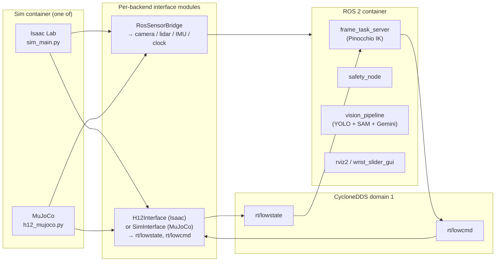

# Humanoid Simulation

Dual-backend simulator for Unitree H1-2 humanoid robots. Both backends speak the
real robot's CycloneDDS protocol on `rt/lowstate` / `rt/lowcmd`, so a single
controller binary targets either physics engine or the actual robot with no
code changes.

---

## Quick Start

**Prerequisites** — Linux + NVIDIA GPU + driver 570.x, Docker with the NVIDIA
runtime, ~10 GB free disk for the MuJoCo image.

```bash
# 1. Clone with submodules.
git clone --recurse-submodules https://github.com/correlllab/Humanoid_Simulation.git
cd Humanoid_Simulation

# 2. Build the MuJoCo backend (smallest path; ~10 min on a fresh host).
sed -i 's/^PROFILES=.*$/PROFILES=(mujoco)/' docker/scripts/docker_build.sh
./docker/scripts/docker_build.sh

# 3. Run a working demo.
./docker/scripts/docker_run.sh mujoco
```

You should see the MuJoCo passive viewer with the H1-2 robot suspended on a
pelvis-fixed scene. The container also publishes `rt/lowstate` on CycloneDDS
domain 1 plus camera/lidar/IMU on ROS 2 topics — see the *Smoke Test* section
to verify.

For other backends (Isaac Lab GPU sim, ROS 2 control stack), full setup,
training, or troubleshooting, see below.

---

## Table of Contents

- [Overview](#overview)
- [Features](#features)
- [Supported Backends](#supported-backends)
- [Architecture](#architecture)
- [Tech Stack](#tech-stack)
- [Prerequisites](#prerequisites)
- [Installation](#installation)
- [Configuration](#configuration)
- [Usage](#usage)
- [Robot Models & Assets](#robot-models--assets)
- [Tasks / Environments](#tasks--environments)
- [API Reference](#api-reference)
- [Project Structure](#project-structure)
- [Development](#development)
- [Testing](#testing)
- [Reproducibility](#reproducibility)
- [Troubleshooting](#troubleshooting)
- [Contributing](#contributing)
- [License](#license)
- [Acknowledgments](#acknowledgments)

---

## Overview

This repository wraps two independent physics simulators behind a common DDS
interface so that the same controller stack works against either:

- **NVIDIA Isaac Lab** (Isaac Sim 4.5.0 + IsaacLab v2.0.2) — GPU-accelerated
  physics with PhysX 5, USD scene format, and a manager-based RL environment.
- **MuJoCo 3.6.0** — lightweight CPU/EGL physics with MJCF scenes and a
  passive viewer.

Both processes publish on **CycloneDDS domain 1** with `unitree_sdk2py`'s
`rt/lowstate` / `rt/lowcmd` topics, matching the protocol the real Unitree H1-2
hardware uses on domain 0. The same code path that drives a real robot drives
the sim — switch domains, switch targets.

A separate ROS 2 Humble container runs the control / perception side: a
Pinocchio-based IK frame-task action server, a vision pipeline (YOLO + Gemini +
SAM), a safety layer, and RViz. Sensor data (RealSense head camera, Livox
lidar, IMU, `/tf`, `/clock`) flows from sim → ROS 2 over the standard ROS 2
RTPS wire on `ROS_DOMAIN_ID=1`.

The whole system is split across three Docker images that share a common base
to avoid duplicating CUDA, ROS 2, CycloneDDS, `unitree_sdk2py`, and PyTorch.

---

## Features

- **Two simulation backends** behind a common DDS interface (`H12Interface` /
  `SimInterface`) so controllers run unmodified against either.
- **CycloneDDS-on-domain-1** wire compatibility with real Unitree H1-2 hardware
  (Unitree HG protocol, 27-motor body).
- **Watchdog pose-hold** in both backends: if no `rt/lowcmd` arrives for 100 ms
  the sim freezes joints with a stiff PD instead of NaN'ing.
- **Sensor parity across backends** — both publish the same ROS 2 topics
  (`/realsense/head/...`, `/livox/lidar`, `/livox/imu`, `/clock`).
- **Layered Docker build**: shared `humanoid_sim_base` (CUDA 12.2 + ROS 2
  Humble + CycloneDDS 0.10.x + Torch cu130) → `isaac` / `mujoco` / `ros`
  variants.
- **Headless support**: both backends auto-switch to `--headless` when no
  `DISPLAY` is reachable (CI / SSH / cloud).
- **Force injection** in MuJoCo: keyboard-driven external force / torque per
  link, plus an upright "elastic band" tether for free-standing scenes.
- **Shader cache persistence** for Isaac Sim — first-boot ~20-40 min compile is
  bind-mounted into the host so subsequent boots are fast.
- **ROS 2 control stack**: differential IK frame-task server, joint-limit
  safety layer, RealSense + LiDAR drivers, FAST-LIO SLAM, vision pipeline.

---

## Supported Backends

| Backend | Engine version | OS | GPU | Parallel envs | Determinism | Status | Limitations |
|---------|---------------|----|-----|---------------|-------------|--------|-------------|
| MuJoCo | `mujoco==3.6.0` | Ubuntu 22.04 (Docker) | Optional (EGL); CPU works | `num_envs=1` (single-process) | Deterministic with `mj_step` if seeded; no DR | First-class | Free-standing scene has known QACC NaN at startup; pelvis-fixed scene is the default |
| Isaac Lab | Isaac Sim `4.5.0.0` + IsaacLab `v2.0.2` | Ubuntu 22.04 (Docker) | **Required** (PhysX GPU); RTX 30 / 40 / 50 | `num_envs=1` configured, framework supports more | PhysX is GPU-deterministic per seed within same hardware; not bit-exact across GPUs | First-class | First boot compiles shaders for 20-40 min; only one task currently registered (`Isaac-Stack-RgyBlock-H12-27dof-Inspire-Joint`); hand cameras defined in USD but Kit extension `cl_load_rs` not loaded by `sim_main.py` |
| ROS 2 control stack | ROS 2 Humble | Ubuntu 22.04 (Docker) | Required for vision pipeline (CUDA Torch) | n/a (control side) | n/a | First-class | Bringup expects a sim already running on DDS domain 1; vision pipeline needs `GEMINI_KEY` env var for Gemini-based perception (silently empty otherwise) |

Build commands (edit `docker/scripts/docker_build.sh` `PROFILES=(...)`):

| Backend | Build | Run |
|---------|-------|-----|
| MuJoCo | `PROFILES=(mujoco) ./docker/scripts/docker_build.sh` | `./docker/scripts/docker_run.sh mujoco` |
| Isaac Lab | `PROFILES=(isaac) ./docker/scripts/docker_build.sh` | `./docker/scripts/docker_run.sh isaac` |
| ROS 2 control | `PROFILES=(ros) ./docker/scripts/docker_build.sh` | `./docker/scripts/docker_run.sh ros` |

Only one sim backend runs at a time (both bind `rt/*` on domain 1).

---

## Architecture



**Backend abstraction** — there is no single Python ABC that both Isaac and
MuJoCo implement; each backend has a parallel module that produces the same
DDS wire format:

| Concept | Isaac | MuJoCo |
|---------|-------|--------|
| Sim entry point | `CL_isaaclab_sim/sim_main.py` | `h1_mujoco/h12_mujoco.py` |
| DDS interface | `CL_isaaclab_sim/h12_interface.py` (`H12Interface`) | `h1_mujoco/unitree_interface.py` (`SimInterface`) |
| ROS 2 sensor bridge | `CL_isaaclab_sim/isaac_ros_bridge.py` | `h1_mujoco/mujoco_ros_bridge.py` |
| Action provider | `action_provider/h12_dds_action_provider.py` (subclasses `ActionProvider` ABC in `action_provider/action_base.py`) | none — DDS handler writes `data.ctrl` directly |
| Physics step | `RobotController.step()` calls `env.step(action)` at `--step_hz` | Main thread calls `mujoco.mj_step` at `model.opt.timestep` (5 ms) |
| Scene format | USD (`assets/env_assets/h1_2_*.usd`) | MJCF (`assets/scene_handless*.xml`) |

**Selection** — there is no runtime backend flag in the application code; the
backend is chosen by *which Docker compose profile is launched* (`isaac` vs
`mujoco`). Each container only contains one engine. The two backends are
otherwise interchangeable from the controller's point of view because they
publish the same DDS topics on domain 1.

**Adding a new backend** (e.g. PyBullet, Genesis, Drake):
1. Create `docker/<NewBackend>Dockerfile` inheriting from `humanoid_sim_base`.
2. Add a `<newbackend>` profile to `docker/docker-compose.yml`.
3. Implement an interface module that publishes `LowState_` and subscribes to
   `LowCmd_` on CycloneDDS domain 1, mapping motor slots 0..26 to the engine's
   joints.
4. Implement a sensor bridge that publishes the same ROS 2 topic set as
   `mujoco_ros_bridge.py` / `isaac_ros_bridge.py`.
5. Add `docker/scripts/launch_<newbackend>.sh` and reuse `H12_HANDLESS` URDF /
   meshes from `assets/`.
6. Match the watchdog: if no `rt/lowcmd` for 100 ms, hold last joint pose with
   a stiff PD.

---

## Tech Stack

| Layer | Components |
|-------|-----------|
| Languages | Python 3.10, C++ (ROS 2 packages, Livox SDK2) |
| Physics | MuJoCo 3.6.0; PhysX 5 via Isaac Sim 4.5.0 |
| RL framework | Isaac Lab (`isaaclab.envs.ManagerBasedRLEnv`); no separate RL trainer in this repo |
| Control / IK | Pinocchio (apt + pip `pin`), `pink`, `mink`, `pin-pink`, `qpsolvers`, `proxsuite`, `quadprog` |
| Robot SDK | `unitree_sdk2py` (Unitree HG protocol on CycloneDDS) |
| ROS 2 | Humble, `ros-humble-ros-base`, `rmw_cyclonedds_cpp`, `cv_bridge`, `tf2-ros` |
| DDS | CycloneDDS 0.10.x (built from source) + PyPI `cyclonedds` wheel |
| Perception | OpenAI CLIP, Ultralytics YOLO, SAM2 + SAM3, Hugging Face transformers, Google `genai` (Gemini), Open3D |
| GPU | CUDA 12.2 base; PyTorch cu130 wheels (sm_120 / Blackwell support) |
| Container | Docker + `nvidia` runtime + `docker compose` profiles |

**Notable pinning concerns** — `pip==23`, `setuptools==65` (Isaac), `setuptools==59.6.0`,
`wheel<0.44`, `numpy<2` (ROS), Isaac Sim `4.5.0.0`, IsaacLab `v2.0.2`, CycloneDDS
`releases/0.10.x`. See *Configuration* and the Dockerfiles for why.

---

## Prerequisites

| Requirement | Version | Required for |
|-------------|---------|--------------|
| OS | Ubuntu 22.04 (host or any Linux that runs the NVIDIA container runtime) | All |
| NVIDIA driver | 570.x recommended; 595 has known instability | All GPU-using profiles |
| Docker | with NVIDIA Container Toolkit | All |
| `docker compose` | v2 (subcommand, not `docker-compose`) | All |
| Python | 3.10 (provided inside containers; not needed on host) | All |
| CUDA | 12.2 in base image; cu130 wheels for Torch | All |
| Disk | ~25-30 GB for Isaac image, ~10 GB for MuJoCo, ~15 GB for ROS | Per profile |
| GPU memory | 8 GB+ for Isaac Sim, 2 GB+ for MuJoCo (only for offscreen rendering / EGL) | Isaac always; MuJoCo for headless cam |
| X11 display | Optional, needed for native viewers (Isaac viewport, MuJoCo GLFW, RViz) | Per profile |

---

## Installation

```bash
git clone --recurse-submodules https://github.com/correlllab/Humanoid_Simulation.git
cd Humanoid_Simulation
```

If you already cloned without `--recurse-submodules`:

```bash
git submodule update --init --recursive
```

Then choose a backend. The default `docker/scripts/docker_build.sh` builds
`PROFILES=(ros)` — edit that array (line 8) to pick what you need:

```bash
PROFILES=(mujoco)              # smallest, fastest
PROFILES=(isaac)               # GPU sim only
PROFILES=(ros)                 # control stack only (default)
PROFILES=(isaac mujoco ros)    # everything
```

Then run:

```bash
./docker/scripts/docker_build.sh
```

The base image (`humanoid_sim_base`) is always built first. Subsequent builds
inherit from it. Build times on a fast connection: base ~6 min, mujoco ~3 min,
isaac ~25 min (Isaac Sim wheels are multi-GB), ros ~15 min.

**Isaac Sim EULA** is auto-accepted via `OMNI_KIT_ACCEPT_EULA=yes` in
`docker/IsaacDockerfile`. By using this repo you accept it.

**No host-side Python install is required** — `assets/`, `CL_isaaclab_sim/`,
and `h1_mujoco/` are bind-mounted into the containers at runtime so code edits
take effect without rebuilding.

---

## Configuration

| Name | Where | Type | Default | Purpose | Backend |
|------|-------|------|---------|---------|---------|
| `ROS_DOMAIN_ID` | env / compose | int | `1` | Sets ROS 2 / Cyclone domain. Sims are pinned to 1; real hardware to 0. `docker_run.sh` rewrites `0`/empty → `1` | All |
| `MUJOCO_GL` | env / compose | str | `glfw` (default), `egl` (when `--headless`) | OpenGL backend for offscreen vs. windowed rendering | MuJoCo |
| `DISPLAY` | env | str | host `$DISPLAY` | X11 forwarding for native viewers | All viewer modes |
| `XAUTHORITY` | env | path | `$HOME/.Xauthority` | X11 auth | All viewer modes |
| `OMNI_KIT_ACCEPT_EULA` | Dockerfile | str | `yes` | Auto-accept Isaac EULA | Isaac |
| `OMNI_KIT_ALLOW_ROOT` | Dockerfile | int | `1` | Allow Isaac Sim to run as root in container | Isaac |
| `CYCLONEDDS_HOME` | Dockerfile | path | `/cyclonedds/install` | Points the PyPI cyclonedds wheel at the from-source CycloneDDS 0.10.x | All |
| `RMW_IMPLEMENTATION` | env (base) | str | `rmw_cyclonedds_cpp` | Default ROS 2 middleware. **Do not set** in `launch_isaac.sh` — see *Troubleshooting* | All |
| `GEMINI_KEY` | env | str | `""` (stub) | API key for Gemini perception backend | ROS (vision pipeline) |
| `HEADLESS` | env / arg | flag | unset | Forces `--headless` even with a display | Isaac, MuJoCo |
| `PYTHONUNBUFFERED` | Dockerfile | str | `1` (Isaac launcher) | Stream Isaac logs in real time | Isaac |

**Sim CLI flags** (`launch_isaac.sh` / `launch_mujoco.sh`):

| Flag | Default | Backend | Meaning |
|------|---------|---------|---------|
| `--task <name>` | `Isaac-Stack-RgyBlock-H12-27dof-Inspire-Joint` | Isaac | Gym task ID |
| `--reset-cache` | off | Isaac | Wipes `~/.cache/ov/texturecache` (forces shader recompile) |
| `--headless` | auto-set if no `DISPLAY` | Both | No native viewer; uses EGL for offscreen render |
| `--step_hz <int>` | 100 | Isaac | Control loop rate |
| `--physics_dt <float>` | unset (uses task default 0.005) | Isaac | Physics dt override |
| `--render_interval <int>` | task default | Isaac | Frames between renders |
| `--solver_iterations <int>` | task default | Isaac | PhysX position-iteration count |
| `--no_render` | off | Isaac | Disables rendering entirely |
| `--seed <int>` | 42 | Isaac | RNG seed for env / scene resets |
| `--fixed` | implicit when no args | MuJoCo | Pelvis pinned to world (loads `scene_handless_pelvis_fixed.xml`) |
| `--force <link...>` | none | MuJoCo | Enable external-force keyboard interface on listed body names |
| `--viewer` / no `--headless` | viewer on | MuJoCo | GLFW passive viewer (requires X11) |

**ROS 2 bringup args** — `ros2 launch h1_bringup h1_sim_bringup.launch.py`:

| Argument | Default | Purpose |
|----------|---------|---------|
| `use_rviz` | `true` | Start RViz with `sim.rviz` |
| `rviz_config` | `<bringup>/rviz/sim.rviz` | Override RViz config |
| `config` | `<bringup>/config/sim_network.yaml` | Sets `domain_id: 1` and loosens estop limits for sim |

---

## Usage

### Run a demo

```bash
# MuJoCo (default scene is pelvis-fixed because the free-standing scene has
# known startup transients that trip the safety estop):
./docker/scripts/docker_run.sh mujoco

# Isaac Lab (first boot compiles shaders for 20-40 min; cached afterward):
./docker/scripts/docker_run.sh isaac
```

### Switch backends

Stop the running sim (Ctrl-C), then:

```bash
./docker/scripts/docker_run.sh <backend>     # mujoco | isaac
```

Both publish on the same DDS domain 1 with the same `rt/lowstate` / `rt/lowcmd`
topics, so your controller does not need to know which is running.

### Run the ROS 2 control stack

```bash
# Terminal 1: start a sim (mujoco or isaac).
./docker/scripts/docker_run.sh mujoco

# Terminal 2: start the ROS 2 container and bring up the control stack.
./docker/scripts/docker_run.sh ros
# inside the container:
ros2 launch h1_bringup h1_sim_bringup.launch.py
```

This runs (in order):

1. `robot_state_publisher` (consumes `assets/h1_2_handless_ros.urdf`)
2. `sim_joint_state_publisher` (h1_bringup wrapper that forces DDS domain 1)
3. `frame_task_server` (Pinocchio IK action server, accepts `FrameTask.action`)
4. `vp_node` (vision pipeline)
5. `safety_node` (joint-limit / collision guard)
6. `rviz2 -d sim.rviz`
7. `wrist_slider_gui` — cv2 trackbar panel for `left_wrist_yaw_link` and
   `right_wrist_yaw_link` 6-DoF target poses (delayed 3 s so RViz initializes
   Qt before cv2 imports its bundled Qt plugins)

### Run a specific Isaac task

```bash
./docker/scripts/docker_run.sh isaac \
    /home/code/h12_sim_scripts/launch_isaac.sh \
    Isaac-Stack-RgyBlock-H12-27dof-Inspire-Joint
```

(Stack-RgyBlock is currently the only registered task — see *Tasks /
Environments*.)

### Run MuJoCo with custom args

```bash
./docker/scripts/docker_run.sh mujoco \
    /home/code/h12_sim_scripts/launch_mujoco.sh --fixed --force torso_link
```

### Drop to a shell

```bash
./docker/scripts/docker_run.sh isaac bash
./docker/scripts/docker_run.sh mujoco bash
./docker/scripts/docker_run.sh ros bash
```

### Train a policy

There is **no training loop in this repository**. `sim_main.py` runs the env
forward and forwards external DDS commands; it does not call
`env.step` with a learned policy. To train, point an external Isaac Lab
training script at `Isaac-Stack-RgyBlock-H12-27dof-Inspire-Joint` (config:
`StackRgyBlockH1227dofInspireBaseFixEnvCfg`).

### Visualize / record video

- **MuJoCo viewer** (default): launches passive GLFW viewer; press P to pause,
  arrow keys to move the elastic band anchor, F to toggle external force.
- **Headless + RViz / Foxglove Studio**: set `DISPLAY` empty (or pass
  `--headless`); subscribe externally to `/realsense/head/color/image_raw`,
  `/livox/lidar`, `/livox/imu`, `/tf`, `/clock` on `ROS_DOMAIN_ID=1`.
- **Isaac viewport** (default): comes up automatically; viewport server is
  destroyed by `sim_main.py` on shutdown.
- **Recording** is not built in. Use OBS or `ffmpeg` against the X11 display,
  or `ros2 bag record` for sensor data.

### Run in headless mode

Both backends auto-detect when no `DISPLAY` is set and switch to headless
(`MUJOCO_GL=egl` for MuJoCo, `--headless` for Isaac). To force it explicitly:

```bash
HEADLESS=1 ./docker/scripts/docker_run.sh isaac
./docker/scripts/docker_run.sh mujoco /home/code/h12_sim_scripts/launch_mujoco.sh --fixed --headless
```

---

## Robot Models & Assets

| File (in `assets/`) | Backend | Purpose |
|--------------------|---------|---------|
| `h1_2.urdf` / `h1_2_ros.urdf` | ROS / MuJoCo | Full H1-2 with Inspire hands |
| `h1_2_handless.urdf` / `h1_2_handless_ros.urdf` | ROS / MuJoCo | H1-2 without hands; `_ros.urdf` adds `camera_link` and `lidar_link` joints |
| `h1_2_handless.xml` | MuJoCo | MJCF body for the handless robot |
| `scene_handless.xml` | MuJoCo | Free-standing scene with elastic-band tether |
| `scene_handless_pelvis_fixed.xml` | MuJoCo | Pelvis welded to world (default — avoids the QACC-NaN startup transient) |
| `h1_2_handless_collision.srdf` / `h1_2_handless_sphere.urdf` | Both | Collision proxies (sphere swept volumes) |
| `meshes/*.STL` | Both | STL meshes referenced by URDF/MJCF |
| `magpie/*.xml` | MuJoCo (in progress) | UR5e + Magpie eflesh gripper (per recent commits, partial port) |
| `Payload/` | Both | Misc. payload meshes |
| `env_assets/h1_2_26dof_with_inspire_rev_1_0_with_CL_realsense.usd` | Isaac | H1-2 USD with attached RealSense D455 head camera |
| `env_assets/rsd455.usd` | Isaac | Standalone RealSense D455 USD |
| `env_assets/ikea_table_usd/` | Isaac | Table prop |

**Adding a new robot** — drop the URDF/MJCF and meshes into `assets/`, register
an `ArticulationCfg` in `CL_isaaclab_sim/robots/unitree.py` (Isaac) or include
the new MJCF body in a scene (`assets/scene_*.xml`), then either re-use
`H12Interface` / `SimInterface` (if it's a 27-motor variant) or fork them and
adjust `NUM_MOTORS` and the motor → joint index mapping.

---

## Tasks / Environments

Isaac Lab tasks are registered via `gym.register` under
`CL_isaaclab_sim/tasks/h1-2_tasks/`.

| Task ID | Robot | Hand | Object(s) | Status |
|---------|-------|------|-----------|--------|
| `Isaac-Stack-RgyBlock-H12-27dof-Inspire-Joint` | H1-2 | Inspire | red / green / yellow blocks on a table | Registered, default in `launch_isaac.sh` |
| `Isaac-PickPlace-Cylinder-...` | — | — | — | **Not registered.** `sim_main.py`'s argparse default still references it; `tasks/__init__.py` blacklists `pick_place`. Don't pass it to `--task`. |

**Stack-RgyBlock environment** — `StackRgyBlockH1227dofInspireBaseFixEnvCfg`
(`tasks/h1-2_tasks/stack_rgyblock_h12_27dof_inspire/stack_rgyblock_h12_27dof_inspire_joint_env_cfg.py`):

| Manager | Contents |
|---------|----------|
| Scene | `TableRedGreenYellowBlockSceneCfg` — robot (`h12_27dof_inspire_base_fix`, init at `(-4.2, -3.7, 0.76)`), table, three colored blocks, head camera |
| Actions | `JointPositionActionCfg(joint_names=[".*"], scale=1.0, use_default_offset=True)` — direct joint position control over all 39 actuated DoFs (27 body + 12 finger pairs) |
| Observations (`PolicyCfg`) | `robot_joint_state`, `robot_inspire_state`, `camera_image` (no concatenation, no corruption) |
| Rewards | `mdp.compute_reward` (single term, weight=1.0) |
| Terminations | `mdp.reset_object_estimate` |
| Sim | `dt=0.005`, `decimation=2`, `episode_length_s=20.0`, PhysX CCD on, 16 position-iters |
| Resets | Uniform pose perturbation per block in `[-0.05, +0.05]` m on x/y; `reset_object_self` event |

**MuJoCo "tasks"** are just MJCF scenes — there is no manager-based env layer.
The two scenes (`scene_handless.xml`, `scene_handless_pelvis_fixed.xml`) are
both passive arenas; "task" semantics live in whatever controller you connect
to `rt/lowcmd`.

---

## API Reference

### Backend-side (sim processes)

`H12Interface(env)` — `CL_isaaclab_sim/h12_interface.py`

```python
from h12_interface import H12Interface

h12 = H12Interface(env)        # binds rt/lowstate, rt/lowcmd on domain 1
action = h12.get_action()      # returns (1, num_joints) torch tensor (PD command)
h12.shutdown()                 # detaches env, threads exit
```

`SimInterface(model, data, lock=None)` — `h1_mujoco/unitree_interface.py`

```python
from unitree_interface import SimInterface

sim_interface = SimInterface(mujoco_env.model, mujoco_env.data, lock=sim_lock)
# Publishes on rt/lowstate and writes incoming rt/lowcmd directly to data.ctrl.
# No public methods — interaction is via the DDS topics.
```

`RosSensorBridge` (Isaac and MuJoCo) — same constructor shape (camera/lidar
rates, frame IDs); both expose `.tick()` and `.shutdown()`. See
`isaac_ros_bridge.py` and `mujoco_ros_bridge.py` for tunables.

`ActionProvider` (ABC) — `CL_isaaclab_sim/action_provider/action_base.py`

```python
class ActionProvider(ABC):
    def __init__(self, name: str): ...
    @abstractmethod
    def get_action(self, env) -> Optional[torch.Tensor]: ...
    def start(self) / stop() / cleanup(): ...
```

Concrete: `H12DdsActionProvider(h12_interface)` — wraps `H12Interface` so the
`RobotController` can pull commands once per tick.

### Controller-side (DDS clients)

```python
from unitree_sdk2py.core.channel import (
    ChannelFactoryInitialize, ChannelPublisher, ChannelSubscriber,
)
from unitree_sdk2py.idl.unitree_hg.msg.dds_ import LowState_, LowCmd_

ChannelFactoryInitialize(1)                               # domain 1 = sim
sub = ChannelSubscriber("rt/lowstate", LowState_)
sub.Init(lambda msg: print(msg.tick), 10)

pub = ChannelPublisher("rt/lowcmd", LowCmd_)
pub.Init()
pub.Write(LowCmd_())                                      # 27 motor cmds + IMU
```

DDS topic contract: `LowState_` carries 27 motor states (q, dq, tau_est) +
IMU; `LowCmd_` carries 27 motor commands (`mode`, `q`, `dq`, `tau`, `kp`,
`kd`). Both interfaces use the standard Unitree CRC.

### Backend interface contract (informal)

A backend module must:

- Initialize CycloneDDS on domain 1.
- Publish `rt/lowstate` (`LowState_` IDL) at the physics tick rate.
- Subscribe to `rt/lowcmd` (`LowCmd_` IDL) and apply `tau + kp*(q-q_meas) +
  kd*(dq-dq_meas)` per motor when `mode == 1`.
- Implement a 100 ms watchdog that snapshots joint positions and applies a
  stiff PD pose-hold when commands stop arriving.
- (Optionally) instantiate a `RosSensorBridge`-equivalent that publishes
  `/clock`, `/realsense/head/...`, `/livox/lidar`, `/livox/imu` on the
  default RTPS middleware.

---

## Project Structure

```
Humanoid_Simulation/
├── docker/
│   ├── BaseDockerfile             # CUDA 12.2 + ROS 2 Humble + CycloneDDS 0.10.x +
│   │                              # uv + unitree_sdk2py + Torch cu130 + pin/pink/mink
│   ├── IsaacDockerfile            # base → Isaac Sim 4.5.0 + IsaacLab v2.0.2
│   ├── MujocoDockerfile           # base → MuJoCo 3.6.0 + EGL/OSMesa
│   ├── RosDockerfile              # base → colcon, rviz2, Livox SDK2, full vision ML stack
│   ├── docker-compose.yml         # 'isaac' / 'mujoco' / 'ros' profiles, GPU + X11 + bind mounts
│   └── scripts/
│       ├── docker_build.sh        # Builds base then selected PROFILES (default: ros)
│       ├── docker_run.sh          # xhost + docker compose run for the chosen profile
│       ├── launch_isaac.sh        # Runs sim_main.py inside the isaac container
│       ├── launch_mujoco.sh       # Runs h12_mujoco.py; auto-headless if no DISPLAY
│       └── launch_ros.sh          # colcon build (idempotent) + bash
│
├── assets/                        # Robot URDFs/MJCFs, meshes, scenes (bind-mounted ro)
│   ├── h1_2*.urdf, *.xml
│   ├── scene_handless*.xml        # MuJoCo scenes (free + pelvis-fixed)
│   ├── meshes/                    # STL meshes
│   ├── magpie/                    # UR5e + Magpie gripper assets (in-progress port)
│   ├── Payload/                   # Misc payload meshes
│   └── env_assets/                # Isaac USDs (H1-2+RealSense, IKEA table)
│
├── CL_isaaclab_sim/               # Isaac Lab task library + sim entry (submodule)
│   ├── sim_main.py                # Entry: AppLauncher + env + H12Interface + bridge
│   ├── h12_interface.py           # DDS interface — publishes rt/lowstate, applies rt/lowcmd
│   ├── isaac_ros_bridge.py        # ROS 2 sensor publishers (camera, lidar via PhysX raycast, IMU)
│   ├── robots/unitree.py          # H1-2 + Inspire-hand ArticulationCfg
│   ├── tasks/                     # Manager-based env configs and gym registrations
│   │   ├── h1-2_tasks/stack_rgyblock_h12_27dof_inspire/
│   │   ├── common_config/         # H12RobotPresets, CameraPresets
│   │   ├── common_observations/   # h12_27dof_state, ISAAC_TO_DDS_INDICES, get_robot_imu_data
│   │   ├── common_event/          # event manager helpers
│   │   ├── common_scene/          # base_scene_stack_rgyblock and friends
│   │   ├── common_rewards/, common_termination/
│   │   └── utils/                 # parse_cfg
│   ├── action_provider/           # ActionProvider ABC + H12DdsActionProvider
│   ├── layeredcontrol/            # RobotController (step_hz, action plumbing)
│   ├── exts/isaac_exts/
│   │   ├── cl_load_rs/            # Hand-camera Kit ext (defined; not loaded by sim_main)
│   │   └── cl_reset_button/       # Reset button Kit ext (in progress)
│   ├── dds/                       # Loose DDS helpers
│   ├── doc/                       # Isaac Sim 4.5 / 5.0 install notes (Chinese + English)
│   └── .isaac_cache/              # Bind-mounted shader/texture cache (gitignored)
│
├── h1_mujoco/                     # MuJoCo H1-2 simulator (submodule)
│   ├── h12_mujoco.py              # Entry: scene load + sim loop + viewer
│   ├── mujoco_env.py              # MujocoEnv class, ElasticBand, EndEffectorForce
│   ├── unitree_interface.py       # DDS interface, watchdog pose-hold
│   └── mujoco_ros_bridge.py       # ROS 2 sensor publishers (camera, lidar via mj_ray, IMU)
│
└── core_ws/                       # ROS 2 Humble workspace (colcon)
    └── src/
        ├── h1_bringup/            # This repo's launch + rviz + slider GUI + DDS-domain wrappers
        ├── h12_ros2_controller/   # Pinocchio IK + frame_task action server (submodule)
        ├── h12_ros2_model/        # H1-2 URDF + robot_description (submodule)
        ├── h12_safety_layer/      # Joint-limit / collision guard (submodule)
        ├── h12_realsense/         # RealSense D455 driver (submodule)
        ├── vision_pipeline/       # YOLO + SAM + Gemini perception (submodule)
        ├── custom_ros_messages/   # FrameTask.action + DDS msg bridges (submodule)
        ├── magpie_control/, magpie_msgs/   # UR5 + Magpie gripper stack (submodule)
        ├── FAST_LIO/              # LiDAR-inertial SLAM (upstream submodule, ROS2 branch)
        ├── livox_ros_driver2/     # Livox MID360 driver (upstream submodule)
        └── unitree_ros2/          # Unitree HG/GO/API ROS 2 message defs (upstream submodule)
```

`core_ws/src/*` are git submodules; **do not patch them in-place** — fix
build / env issues in `docker/RosDockerfile` instead.

---

## Development

There is no host-side Python package — all work happens inside the containers.
Common loops:

```bash
# Edit code on the host (bind-mounted into the container).
$EDITOR CL_isaaclab_sim/sim_main.py

# Re-run inside the container without rebuilding the image:
./docker/scripts/docker_run.sh isaac

# For the ROS workspace, colcon build is idempotent on launch_ros.sh: if any
# package.xml is newer than install/setup.bash, it rebuilds.
./docker/scripts/docker_run.sh ros
# or, inside the running container:
cd /home/code/core_ws && colcon build --symlink-install
```

There is **no host-side lint / format / typecheck / pre-commit configuration**
checked into this repo. Lint and format inside the relevant submodule's own
toolchain if needed.

To rebuild a single profile after Dockerfile changes:

```bash
docker compose -f docker/docker-compose.yml --profile isaac build isaac
```

---

## Testing

There is **no test suite at the top level** of this repository — no `pytest`
config, no GitHub Actions / CI, no automated determinism harness. Per-submodule
`test/` directories exist (e.g. `core_ws/src/h1_bringup/test/`) but contain
only the default ament/colcon scaffolding.

The recommended manual smoke test:

### 1. DDS — verify `rt/lowstate`

```bash
# Terminal 1: start MuJoCo sim.
./docker/scripts/docker_run.sh mujoco

# Terminal 2: exec into the running container.
docker exec -it $(docker ps -qf "ancestor=humanoid_sim_mujoco") bash
source /opt/ros/humble/setup.bash

python3 -c "
from unitree_sdk2py.core.channel import ChannelFactoryInitialize, ChannelSubscriber
from unitree_sdk2py.idl.unitree_hg.msg.dds_ import LowState_
ChannelFactoryInitialize(1)
sub = ChannelSubscriber('rt/lowstate', LowState_)
sub.Init(lambda msg: print(f'tick={msg.tick}  motor[0].q={msg.motor_state[0].q:.4f}'), 10)
import time; time.sleep(3)
"
# Expected: tick increments, motor[0].q shows a plausible joint angle.
```

### 2. DDS — verify `rt/lowcmd`

```bash
python3 -c "
from unitree_sdk2py.core.channel import ChannelFactoryInitialize, ChannelPublisher
from unitree_sdk2py.idl.unitree_hg.msg.dds_ import LowCmd_
ChannelFactoryInitialize(1)
pub = ChannelPublisher('rt/lowcmd', LowCmd_)
pub.Init()
pub.Write(LowCmd_())
print('lowcmd sent — check sim logs for cmd received')
"
```

### 3. ROS 2 sensor topics

```bash
# Inside the sim container (ROS_DOMAIN_ID=1 is set):
ros2 topic hz /realsense/head/color/image_raw                              # ~10 Hz, rgb8
ros2 topic echo --once /realsense/head/color/image_raw --no-arr | head -10
ros2 topic hz /realsense/head/aligned_depth_to_color/image_raw             # ~10 Hz, 16UC1
ros2 topic echo --once /realsense/head/color/camera_info | head -15        # K matrix non-zero
ros2 topic hz /livox/imu                                                   # ~100 Hz
ros2 topic hz /livox/lidar                                                 # ~5 Hz
ros2 topic hz /clock                                                       # every sim step
```

### 4. ROS 2 control stack (optional)

```bash
./docker/scripts/docker_run.sh ros
# inside:
ros2 launch h1_bringup h1_sim_bringup.launch.py
# Expected: rviz opens with robot model, TF tree connected,
# wrist slider GUI appears after ~3s.
```

---

## Reproducibility

- **Seeds** — Isaac: pass `--seed <int>` to `launch_isaac.sh` (default 42).
  MuJoCo: no built-in seed flag (deterministic given a fixed scene and command
  stream; add seeding manually if you need stochastic resets).
- **Determinism** — MuJoCo `mj_step` is deterministic on a given build; PhysX
  GPU is deterministic per seed on the *same* hardware but is **not** bit-exact
  across different GPUs / driver versions.
- **Pinned versions** — every external dep is pinned in the Dockerfiles. Major
  pins to avoid bumping casually:
  - CycloneDDS `releases/0.10.x` (PyPI `cyclonedds` wheel needs the removed
    `dds/ddsi/q_radmin.h`)
  - Isaac Sim `4.5.0.0` (last with Python 3.10 wheels; ≥5.x needs 3.11+)
  - IsaacLab `v2.0.2` (HEAD needs `wp.transform_compose` from omni.warp ≥ 5.1)
  - Numpy `<2` in Isaac (Isaac Sim 4.5 imports `from numpy.lib.stride_tricks
    import broadcast_to`, removed in 2.x) and in ROS (apt scipy/pinocchio ABI)
  - `pip==23` + `setuptools==65` in Isaac (newer break IsaacLab's `./isaaclab.sh`)
  - `setuptools==59.6.0` + `wheel<0.44` in ROS (colcon's `literal_eval` chokes
    on setuptools 70+'s `SpecifierSet`)
  - PyTorch `cu130` (sm_120 / Blackwell — RTX 50-series support)
- **Submodule pinning** — `core_ws/src/*` and `CL_isaaclab_sim` / `h1_mujoco`
  are pinned by SHA in `.gitmodules` + the parent commit, so
  `git submodule update --init --recursive` produces a fixed tree.

---

## Troubleshooting

**`undefined symbol: shm_set_data_state` or `dds_create_domain(1) Precondition
Not Met` when starting Isaac.** Don't set
`RMW_IMPLEMENTATION=rmw_cyclonedds_cpp` in `launch_isaac.sh`. The PyPI
`cyclonedds` wheel that `unitree_sdk2py` pulls in already holds a libddsc
mapping for `rt/*`; forcing rclpy onto the same backend shares one libddsc
across two consumers and a soname race breaks `rclpy.init()`. Leave the env
var unset in the Isaac launcher; FastRTPS interoperates with CycloneDDS over
the RTPS wire on `ROS_DOMAIN_ID=1`.

**First Isaac boot stalls for 20-40 min.** Shader compile. Output is cached in
`./CL_isaaclab_sim/.isaac_cache/ov/`, bind-mounted into the container.
Subsequent boots are fast. To wipe: `rm -rf
CL_isaaclab_sim/.isaac_cache/ov/texturecache`, or pass `--reset-cache` to
`launch_isaac.sh`.

**`no kernel image is available for execution on the device`.** You're on RTX
50-series and Torch resolved to a cu124 wheel. The Dockerfiles re-install Torch
cu130 last to guard against this — verify with `python3 -c "import torch;
print(torch.version.cuda)"` inside the container; expected `13.0`.

**`failed to open libnvrtc-builtins.so.13.0`.** The cu130 dir was not in
`ldconfig`'s cache. The Isaac Dockerfile writes
`/etc/ld.so.conf.d/nvidia-cu13.conf` and runs `ldconfig`; if the file is
missing, recreate it manually inside the container:
`echo /usr/local/lib/python3.10/dist-packages/nvidia/cu13/lib >
/etc/ld.so.conf.d/nvidia-cu13.conf && ldconfig`.

**`xhost: must be on local machine` on remote SSH.** Harmless. The container
still starts. Use `--headless` for fully unattended runs.

**`MUJOCO WARNING: Nan, Inf or huge value in QACC at DOF 0`.** Free-standing
scene (`scene_handless.xml`) has known startup velocity transients on
`shoulder_pitch` that explode QACC. The pelvis-fixed scene
(`scene_handless_pelvis_fixed.xml`) is the default for this reason. If you
need the free scene, send a stable `rt/lowcmd` stream within 100 ms of sim
start so the watchdog pose-hold doesn't kick in mid-explosion.

**`module 'numpy.lib.stride_tricks' has no attribute 'broadcast_to'` in Isaac.**
Numpy bumped past 2.0. Isaac Dockerfile pins `numpy<2`; rebuild the Isaac image
or `uv pip install --system --force-reinstall "numpy<2"` inside the container.

**Colcon build fails with `literal_eval: malformed node or string` on
setuptools.** Setuptools ≥ 70 returns `SpecifierSet` instead of a string.
Pin `setuptools==59.6.0`, `wheel<0.44` (the ROS Dockerfile already does this
in step 7).

**Default `docker_build.sh` builds the wrong profile.** It defaults to
`PROFILES=(ros)`. Edit line 8 to pick what you need (e.g.
`PROFILES=(isaac mujoco ros)` for the full stack).

**`Isaac-PickPlace-Cylinder-...` not found.** That task isn't actually
registered in this checkout — `tasks/__init__.py` blacklists `pick_place`. The
only registered task is `Isaac-Stack-RgyBlock-H12-27dof-Inspire-Joint`, which
is what `launch_isaac.sh` defaults to (overriding `sim_main.py`'s argparse
default).

**`xhost +local:docker` warning, container still starts.** Expected on remote
sessions. Pass `--headless` to suppress the X11 path entirely.

**NVIDIA driver 595 instability.** Use 570.x.

**`rt/*` traffic visible on host network.** The compose services run with
`privileged: true` and `network_mode: host` for CycloneDDS multicast
discovery. Side effect: DDS traffic is on your host interfaces. Acceptable on
a robotics workstation; not acceptable on a multi-tenant box.

---

## Contributing

The top-level repo is a Docker + asset shell over a stack of submodules. To
contribute:

- **Top-level changes** (Dockerfiles, scripts, scenes, this README, `core_ws/src/h1_bringup`): PR
  against this repo.
- **Backend internals** (`CL_isaaclab_sim/`, `h1_mujoco/`,
  `core_ws/src/h12_*`, `core_ws/src/vision_pipeline`,
  `core_ws/src/magpie_*`, `core_ws/src/custom_ros_messages`): PR against the
  respective `correlllab/<repo>` submodule, then bump the submodule SHA here.
- **Upstream submodules** (`FAST_LIO`, `livox_ros_driver2`, `unitree_ros2`):
  do **not** patch in-place. Work around build / env issues in
  `docker/RosDockerfile` instead.
- **Adding a new backend**: see *Architecture → Adding a new backend*. The
  acceptance criterion is wire-compatibility with `rt/lowstate` / `rt/lowcmd`
  on domain 1 and the standard ROS 2 sensor topic set.

There is no separate `CONTRIBUTING.md` at this time.

---

## License

The top-level repo does not currently ship a top-level `LICENSE` file. The
submodules carry their own:

| Submodule | License |
|-----------|---------|
| `CL_isaaclab_sim` | BSD-3-Clause (see `CL_isaaclab_sim/LICENSE`) |
| `h1_mujoco` | see `h1_mujoco/LICENSE` |
| `core_ws/src/h1_bringup` | see `core_ws/src/h1_bringup/LICENSE` |
| `core_ws/src/FAST_LIO` | upstream HKU-MARS license |
| `core_ws/src/livox_ros_driver2` | upstream Livox license |
| `core_ws/src/unitree_ros2` | upstream Unitree license |
| Isaac Sim | NVIDIA Omniverse EULA (auto-accepted by `OMNI_KIT_ACCEPT_EULA=yes` in `docker/IsaacDockerfile`) |
| MuJoCo | Apache 2.0 |

Robot meshes, USDs, and the H1-2 description are derived from Unitree
Robotics; see their public release for redistribution terms.

---

## Acknowledgments

- **Unitree Robotics** — H1-2 robot, `unitree_sdk2_python`, Inspire hand
  description, and reference task scaffolding (much of `CL_isaaclab_sim` is
  derived from Unitree's `unitree_sim_isaaclab`).
- **NVIDIA** — Isaac Sim and Isaac Lab.
- **Google DeepMind** — MuJoCo.
- **HKU-MARS** — FAST-LIO.
- **Livox** — MID360 LiDAR + SDK2.
- **Eclipse CycloneDDS**.
- **Meta AI** — SAM2 / SAM3.
- **OpenAI** — CLIP.
- **Ultralytics** — YOLO.
- **Stéphane Caron / Inria** — Pinocchio, Pink, mink, Pin-Pink.

The Correll Lab maintains the `correlllab/*` submodules (`h1_mujoco`,
`h12_ros2_controller`, `h12_ros2_model`, `h12_safety_layer`,
`h12_realsense`, `vision_pipeline`, `custom_ros_messages`, `magpie_*`,
`CL_isaaclab_sim`).
