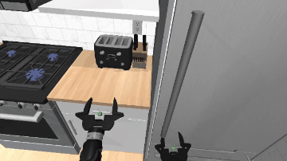

# Humanoid_Simulation

Unitree **H1‑2** humanoid simulation — MuJoCo physics + a ROS 2 (Humble)
workspace, each in its own Docker container, talking over CycloneDDS
(`ROS_DOMAIN_ID=1`).

## Setup

```bash
git submodule update --init --recursive          # also: git lfs install
# vision needs: core_ws/src/vision_pipeline/vision_pipeline/API_KEYS.py  ->  GEMINI_KEY = "..."
docker/scripts/docker_build.sh mujoco ros
xhost +local:docker                              # once per session, so GUIs (viewer/rviz) open
export ROS_DOMAIN_ID=1                           # in every terminal
```

## Demo 1 — open the fridge (band‑held)



```bash
# A — physics sim
docker/scripts/docker_run.sh mujoco

# B — ROS bringup
docker/scripts/docker_run.sh ros
ros2 launch h1_bringup h1_sim_bringup.launch.py use_rviz:=true use_sliders:=true

# C — run the demo
docker exec -it humanoid_sim_ros bash
ros2 run h1_bringup open_fridge.py
```

## Demo 2 — walk to the fridge, then open it

```bash
# A — physics sim, robot spawned back in the aisle
docker/scripts/docker_run.sh mujoco --spawn far

# B — ROS bringup: switchable walk/FAME controller, FAME at launch, nav off
docker/scripts/docker_run.sh ros
ros2 launch h1_bringup h1_sim_bringup.launch.py \
    use_rviz:=true use_sliders:=true use_nav:=true \
    lowerbody_node:=lowerbody_controller_node lowerbody_policy:=fame

# C — stand on FAME -> walk to the fridge (closed-loop) -> switch to FAME -> grasp
docker exec -it humanoid_sim_ros bash
cd /home/code/core_ws/src/h1_bringup/scripts && python3 walk_to_fridge.py
```

To capture the robot's head‑camera view, add to the sim (terminal A):
`--headless --record /home/code/h1_mujoco/<name>.mp4` (stop with Ctrl‑C to finalize).
